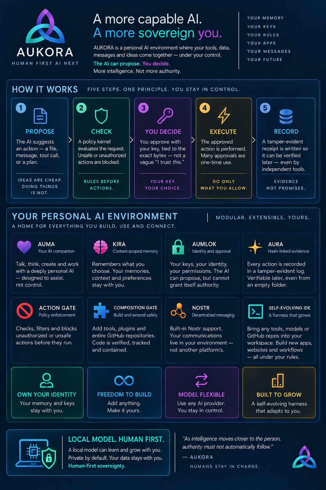

# Nebius Lab — completed research snapshot

**Reference only; this branch is not a product release.** Start with the [Nebius Lab evidence index](research/NEBIUS-LAB.md): completed offline recovery, corrected historical calibration, prospective design and 19 recorded synthetic runner control checks. No new model/provider/training run occurred; GPU work remains HELD and real preregistration inputs are unready.

This branch copies completed research file bytes onto sanitized Prime baseline `a15966fd4cda16186757adf84c954b44f4ccf5c8`. Its retained Prime documentation below describes that baseline and historical evidence, not qualification of a new deployed product. Use the index's per-round limits and ledgers when reviewing the lab.

## Prime baseline documentation



*Human first. AI next.*

The software that proposes an act should not be the authority that permits it.

AUKORA is an open, AGPL personal-AI foundation where the human holds identity, memory and authority. Models and apps are replaceable; the intended durable center is the person and the boundaries they control.

The image describes the intended architecture. The measured implementation status and its limits are below.

## Check it yourself

Use Node 24.11.1 and Python 3.9 or later. From a source review bundle, run:

```sh
git clone --branch main aukora-prime-sanitized.bundle aukora-prime
cd aukora-prime
./prime verify
```

For a GitHub checkout, use `https://github.com/aumara-xyz/aukora-prime.git` as the clone source.

**Recorded pre-publication run at `1b7bd3d7`:** `./prime verify` passed eight ordinary source checks, exit 0, in 2.773 seconds. [The evidence](docs/evidence/publication-source-verification.json) records the observed commit, tree and scope before this documentation cleanup. Run it again on the checkout you received; this record is not a claim about a running product.

Expected final summary:

```text
PASS ordinary source suite; qualification UNPERFORMED; G1 PENDING
```

It reports per-check PASS/FAIL and an explicit UNPERFORMED list. Owner enrollment, live PostgreSQL, current UID separation, guest containment, paid inference and composed pixels are excluded from this source profile. Expect a few seconds for this profile on a recent laptop; its bounded target is under three minutes. The preserved snapshot interface is `./prime verify SNAPSHOT OWNER [RETAINED_HEADS_JSON]`.

## Status

RAN means executed under the stated conditions; SOURCE-ONLY means inspected code; UNPERFORMED means no qualifying execution has been established. The earlier individual contract, controller and CSP results below were recorded at historical pre-publication source `9d6c2205`. Neither those results nor the eight-check source-suite PASS qualify a deployment.

| Status | Claim | Command or evidence | Limit |
| --- | --- | --- | --- |
| Working — recorded RAN | Keyless ordinary source suite: eight configured checks. | `./prime verify` — exit 0, 2.773 seconds at pre-publication `1b7bd3d7`; [recorded output](docs/evidence/publication-source-verification.json). | Real owner, current PG/UID, guest, paid provider and browser qualification remain UNPERFORMED. |
| Working — RAN | Frozen Node/browser contract representations and byte vectors. | `node packages/contracts/check.mjs` — 421 assertions. | Format checks, not complete effect mediation or deployment qualification. |
| Working — RAN | Owner UI controller handles its synthetic review/authentication scenarios. | `node packages/ui/prime-authority/checks/controller.mjs packages/contracts/src/browser.mjs` — 11 cases. | No real enrollment, real authentication or executed effect. |
| Working — RAN | Static HTML script CSP binds selected inline script bytes. | `node harness/check-static-csp.mjs` — 39 assertions, six routes. | Browser parity remains UNPERFORMED; this does not confine the agent. |
| Working in a bounded experiment — recorded RAN | One synthetic-P256-approved save using PG 16, C uid 995 and D uid 994; bytes, citation and receipt survived independent authority, memory and database restarts. | `cat docs/evidence/bounded-memory-experiment.json` inspects the dated summary. | One synthetic save, older source, no real owner; stored, not indexed or searchable. Reading the summary does not repeat the experiment. |
| Disabled — SOURCE-ONLY | Public owner-memory authority and effect routes await trusted host acceptance. | [Runtime bridge](packages/runtime-bridge/README.md), [host interface](harness/OWNER-MEMORY-HANDOFF.md). | A disposable preview access cookie is not owner authority. |
| Disabled — SOURCE-ONLY | Actual OpenShell execution. | [Execution source and qualification](packages/execution/README.md). | Real gateway, TLS/JWT configuration, required Landlock, network denial and remote kill/absence are UNPERFORMED. Mock protocol checks do not qualify them. |
| Disabled — SOURCE-ONLY | Live model inference. | [Inference source](packages/inference/README.md). | No budget-capped real reply has been established. Provider credentials belong in the separate broker/settings path. |
| Proposed | Registered agents and human networking, agentic browser, handset, 27-cell receipt wiring, seven-word ceremony behind the UI and NDI integration. | [Design and Built / Proposed table](docs/AUKORA-GOLDEN-BOUNDARY.md). | These are designs, not functioning product capabilities. |

Real PostgreSQL and separate Linux users are not wholly unperformed: the bounded synthetic experiment above ran. Qualification of the current complete product and current source under those conditions remains UNPERFORMED.

The sanitized integration adds source for exact logout, literal logical-forget review and a native Models companion. A genuine owner build now binds 83 source inputs and 36 published outputs. Source/output verification passes; new composition, Linux boot and browser observation remain separate pending checks.

## Known gaps

At this integration checkpoint:

- The ordinary verifier excludes the long 265-save suite and current deployment qualification. Production sessions retain their five-minute lifetime.
- Server logout, session-bound approvals and the logical-forget review/result join are integrated source. Their current protected runtime and browser path remain unqualified.
- Terminal authority-history compaction is integrated source; acceptance against current deployed state remains unqualified.
- Purge and restore assembly still lacks the two-store marker-before-reservation and request-bound restore join. Logical purge does not erase physical media, WAL or external copies.
- Saved policy-relevant fields must be shown or use fixed server defaults. The review filter still needs a declared policy for NFC, format controls, line separators and invisible fillers without rewriting historical bytes.
- Client lifecycle fixtures cover disposal, cancellation before send and recovery from known outcomes. Lost outcomes remain fenced; the browser-served path remains unqualified.
- Same-UID witness rollback remains a declared limit. Candidate-writable evidence is not an independent trust anchor.
- The signer is synthetic. The owner's real passkey enrollment is the top P1 item and requires the owner's action. A real passkey with user verification establishes a real authenticator with user verification; it does not establish hardware custody, human identity or comprehension.
- OpenShell remains unqualified and disabled. Live inference, a second-machine reproducible release digest, device revocation/key rotation and bounded login-challenge lockout remain unqualified or incomplete.
- Threads needs an actually available read-only workspace host or an explicit unavailable state. UI appearance alone does not establish the host path.
- A genuine v3 owner build is recorded, but new composition, Linux boot and browser observation remain pending. The Apps source has a comment-only privacy adaptation; its donor build input record remains historical and a new Apps build is unperformed. The Models source includes documented DeepSeek metadata; its assembled row and secure credential entry remain unqualified.
- Protected pilot and SSH acceptance configuration is required and has not been provisioned or qualified for this sanitized source.
- A private security reporting contact has not yet been confirmed.

The live agent is not yet fully contained. Root and identity design still need hardening. Every repair should land with a focused regression and update this list when the integrated command actually passes.

## Read and contribute

- [The Golden Boundary — canonical paper](docs/AUKORA-GOLDEN-BOUNDARY.md)
- [Review prompt](SHARE.md)
- [Architecture and build instructions](docs/ARCHITECTURE.md)
- [License inventory](licenses/README.md), [AGPL v3 license text](LICENSE), [donor provenance](provenance/donors.json) and [component ledger](provenance/core-ledger.json)
- [Vulnerability reporting — private contact pending](SECURITY.md)
- [Contributor rules](AGENTS.md)

First-party source currently declares **AGPL-3.0-or-later**. Third-party code retains its own licenses: DSH is MIT, OpenShell is Apache-2.0, and vendored dependencies keep their notices. See the inventory for the specific closure and its gaps.
