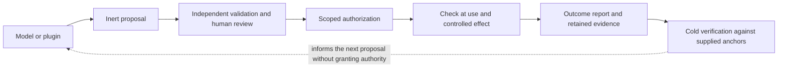

# AUKORA GOLDEN BOUNDARY — Archive
preserved verbatim from docs/AUKORA-GOLDEN-BOUNDARY.md at b86ea6c3a; not edited
[Back to the live paper](AUKORA-GOLDEN-BOUNDARY.md)
## Earlier revision — preserved unchanged below

# AUKORA GOLDEN BOUNDARY

**Human authority, evolving intelligence, independently checkable evidence**

AUKORA research position and engineering roadmap · Revision 2.2 · 26 September 2026

> **Status: research proposal grounded in existing components.** This paper does not
> declare the proposed system implemented, production-safe, or deployed, and it claims no
> completely mediated path and no live network. Publication changes no permissions,
> protocol, running application, or trust anchor.
>
> **Evidence paths (2026-09-27).** Many citations below name Genesis test suites, courts,
> experiments and documents that were archived from the tree on 2026-09-27 (`ARCHIVE.md`).
> They are read at commit `5c8508b7f` of the archive repository aumara-xyz/aukora-genesis-archive (private archive, not a link), where they last existed. The checks that still run from
> a clone of this tree are listed, with their limits, in `docs/CLAIMS.md`.

## Abstract

AUKORA begins with a separation: the software proposing an action must not become the authority that permits it. **[DOCTRINE]**
The family supplies a WASM proposal cell; a composition gate that binds each grant to the loaded bytes of one governed file, but not to the modules that file imports or to its path (open defect D3: a byte-identical copy under the same id at another path is admitted); memory and receipt libraries; and a cold verifier; their pins, executed evidence and limits appear in §3, rather than being treated as one completed deployment. **[BUILT: component scope]**
The integration target is one understandable sequence: propose an exact change, obtain the appropriate permission, check it at use, record the outcome, and let an independent program check the supported claims. **[DOCTRINE]**

Think of modern AI as a box trained on human knowledge: language, code, images, and recorded accounts of experience. **[HORIZON: framing metaphor]**
We can imagine it as an extension of our shared human dream, without mistaking that image for evidence that the machine dreams or experiences life. **[HORIZON]**
As the box gains tools and memory, the question becomes what it may do on our behalf—and who can still say no. **[DOCTRINE]**

The proposed answer is a boundary that survives a change of model, device or interface: greater intelligence does not confer greater permission. **[DOCTRINE]**
Genesis integrates the application; AUKORA-37 demonstrates contracts in a small reference; Diamond cold-verifies named profiles and ships only as pinned copies vendored into both; Cordis manages plugin lifecycle and confines nothing. **[BUILT: component scope]**
Their composition is not proof of complete mediation, exclusive human custody, a deployed witness network, or safe recursive self-improvement. **[DOCTRINE: claim limit]**

The horizon is a person's own evolving extension: able to learn and collaborate across replaceable services while identity continuity, private memory and authority remain portable. **[HORIZON]**
Some owned workflows may avoid global transaction ordering through scoped authorization and a specified non-conflict protocol; shared resources still require suitable agreement and availability arrangements. **[HORIZON]**
The interface may move closer to the person; the authority must remain theirs. **[DOCTRINE]**

## 1. How to read the claims

This paper distinguishes a design obligation from an observation. Words such as
“must” below describe proposed acceptance requirements, not current guarantees.

| Label | Meaning |
| --- | --- |
| **SOURCE_PRESENT** | The cited implementation or test exists at an immutable source pin. It may be unexecuted or unmounted. |
| **TESTED_AT_PIN** | A named command ran against an identified tree; its result, scope, and prerequisites are recorded. A test file alone does not earn this label. |
| **RUNTIME_MEASURED** | A named behavior was observed in a particular running release and composition, with its identity recorded. It is not transferable to another release. |
| **PROPOSED** | An engineering contract or experiment to build and evaluate. |
| **HORIZON** | A research direction with unresolved assumptions and no deployment claim. |

A toy can be tested while remaining a toy. Independent review is a separate annotation:
reviewer, date, pin, method, and scope. Neither a review nor a passing test automatically
promotes source into a runtime claim. **CLEAN means a named profile passed named checks
at a pin; it does not mean safe in the wild.** `CONFINEMENT: NOT_ESTABLISHED` marks every
execution path whose isolation has not been measured. A *court* is a command that must go red when the protection it tests is removed; an *arm* is one check inside it, and a mutation run removes each protection in turn to show that its arm goes red.

Sentence-end classes accompany the evidence vocabulary: **MEASURED** requires a named command and pinned result; **BUILT** identifies implementation within its stated evidence scope, never an automatic live claim; **TOY** bounds an experiment; **DOCTRINE** states an obligation or claim limit; **HORIZON** marks an extrapolation. **[DOCTRINE]**
A live observation recorded by an operator and not re-measured here is labeled operator-recorded, never RUNTIME_MEASURED; author-recorded or author-reported marks a result its author reported that was not re-run here, and lab-recorded marks a laboratory's recorded output that was read but not re-executed. **[DOCTRINE]**

**Pins and evidence for this revision.** Genesis references are to the development head `bf564e7a65` and AUKORA-37 references to its main `7cb6bda`, both of 26 September 2026. Both identifiers name private development history; the published repositories are fresh-history snapshots in which they do not resolve, so paths below name files as published and may have changed since. **[DOCTRINE]**
Preparing Rev 2.2 ran a small set of read-only commands in disposable copies of both trees, plus one court that read the installed release's files without changing them, on one host (Apple M4, 10 cores, 16 GiB, macOS 26.1, Node 22.23.0, under memory pressure); each is named where its result is used, marked “for this revision”. It did not run the complete suites or measure a running application's behavior. **[DOCTRINE: evidence scope]**
The project's own private CI had no fully green run at any commit carrying the 26 September work; the recorded failures are harness defects rather than product failures, two of them Linux-specific, and several courts cited below were skipped because of them. **[DOCTRINE]**
The shipped companions hold the detail: [CLAIMS.md][claims], [CLAIMS-LEDGER.md][ledger], [THREAT-MODEL.md][threat], [CEILINGS.md][ceilings], [WHAT-LEAVES-THIS-MACHINE.md][egress], [GLOSSARY.md][glossary] and the [reading map][reading-map], and [the evidence map][evidence] names, for every evidence-tagged claim, the file or command that checks it; where they and this paper disagree, the more specific pinned statement wins and the disagreement is a defect. **[DOCTRINE]**

## 2. The boundary and the person

The name “Golden Boundary” describes a design commitment, not a special number or a
physical law. Observation, interpretation, recommendation, authorization, execution,
and verification have different jobs. None may silently become another.

The constitutional goals inherited from *Unownable Core* [private source, not published:
an earlier AUKORA note on constitutional goals] are:

- Evidence and reconstructed memories do not create authority.
- An identity does not automatically gain governing power over others.
- A model, evaluator, maintainer, or founder cannot approve its own expansion of power
  merely by describing that expansion as beneficial.
- Removing an observer or mediator does not silently widen an effect path.
- Refusal, interruption, revocation, portability, and exit remain meaningful.

These are obligations to engineer and measure. They are not properties conferred by
the word “unownable.” The operating system, authority holder, trusted software,
distribution path, and people controlling them remain part of the trust analysis.

An aperture is a useful analogy: a narrow interface can make proposed effects legible
and checkable. But an aperture governs only the routes actually forced through it.
If a plugin retains another filesystem, network, signing, or tool path, that path is
outside the claim until measured. Smallness is useful when it reduces the trusted
computing base; it is not evidence that every route has been covered.



The diagram is the intended contract. Each deployed path needs its own evidence that
the composition implements it.

Tolkien's ring offers one useful image: possessing extraordinary power does not establish the right to rule. **[HORIZON: literary analogy]**
AUKORA must make that distinction enforceable without depending on a model, founder or maintainer remaining benevolent. **[DOCTRINE]**

## 3. What the existing technology contributes

This is a dated snapshot, not a live capability inventory. “Earlier main” is the Genesis
main of 24 September 2026, whose CI ran the build courts that the head's CI skipped. The
status column records what one development desktop carried on 26 September, read from its
process arguments and configuration; that shows what a release carries, not how it behaves.

| Component | Contribution | Source | Executed evidence | Development desktop, 26 Sept | Limit |
| --- | --- | --- | --- | --- | --- |
| **Composition gate** | One-use signed grant bound to the loaded bytes of a governed entry file; durable nonce store | [`plugins/aukora-composition-gate/`][composition] | Bytes-bound, pilot and require-grant courts green in private CI at the pin; governed demo green at earlier main. **[TESTED_AT_PIN]** | Loaded as a bootstrap; governs one demonstration module | D3 closed on 27 Sept, after this snapshot: grants now bind the entry's release-relative path and import closure, and `test/declared-id-regression.sh` arm 6 requires the refusal. The AUKORA plugins are admitted by an owner-approved plugin set record, not yet approved or launched in the live app; upstream stock plugins load ungoverned (`STOCK_PLUGINS_NOT_YET_UNDER_POLICY`, [GOVERNED.md][governed]); admission is not confinement. |
| **Cordis** (pinned harness) | Plugin mount, dispose and reload | `upstream-dsh.json` | None for Genesis; its one loader court is unwired. **[SOURCE_PRESENT]** | Hosts every component | Confines nothing; its host runner “isolates globals but is not a security boundary”. |
| **Kira** | Inert staging through the cell, grant-bound settlement, byte-cited recall; also unapproved, unsigned automatic notes that grant nothing | [tools][kira-tools], [memory owner][kira-owner] | Recall courts ±`--mutate` in private CI at the pin; secret-filter court 4/4, three arms red when mutated, for this revision. **[TESTED_AT_PIN]** | Mounted, without automatic notes; a first approval settled, recalled, exported and cold-verified, operator-recorded on 23–24 Sept (approval and recall in live-only rows of [CLAIMS.md][claims]; export and cold verification in a private operator log) | Recall is neither truth nor permission; only staging uses the cell; exactly-once is replay-only in one process; the note filter is five pattern shapes. |
| **WASM proposal cell** | Pinned 64 KiB-budget `memory.put` proposal module on the staging path | [adapter][wasm-adapter], [provenance][wasm-provenance] | [Release court][wasm-test], 4 plain arms against the bytes of the release installed on the §1 host, a local build that is not published, for this revision; no mutation run. **[TESTED_AT_PIN: installed release]** | Present | `CELL_EXECUTION: NOT_ESTABLISHED`; `CONFINEMENT: NOT_ESTABLISHED`; the court reads release bytes in a separate process; the aperture does not confine Node. |
| **Aumlok** | Seven-word acrostic root for root-class acts; HKDF machine key; signer display binding; printed ceilings | [`plugins/aukora-aumlok/`][aumlok] | `measure()` and common-words court (16/16) for this revision; cold-root, derivation, signer and approval courts in private CI at earlier main. **[TESTED_AT_PIN]** | Owner binding with a cold root, operator-recorded on 23 Sept in a private log; the root-key ceiling print is absent | About 34 bits, offline-guessable, no floor (§5). |
| **Aura / Phase 0** | RFC 6962 consistency verifier with a Rust replica; retained log heads | [`scripts/phase0/`][phase0], [verifier][minimal] | Self-test, pin checks and replica build in private CI at the pin. **[TESTED_AT_PIN]** | Retention operator-recorded on 23 Sept in a private log | Heads sit on the same machine and account; an honest prefix can omit later history, and a locally rewritable anchor cannot establish freshness. |
| **Diamond** (vendored) | Offline cold consumer of Kira evidence, from an empty directory | [`vendor/kira-export/`][diamond-cold] | Cold-consumer court for this revision: a real export verifies; byte flips and a small-order-key forgery are refused. **[TESTED_AT_PIN]** | Carried | A vendored copy, not an independent implementation; authorizes nothing; prints `NO_GLOBAL_REPLAY_PREVENTION` and `NO_LATESTNESS`. |
| **Point hygiene** | Refuses non-canonical and small-order Ed25519 points on the gate's verifier | `scripts/composition/ed25519.py` | Five arms, three red arms proven, for this revision; wired plain and `--mutate` into the front door and CI at a later commit, with no green CI run recorded yet. **[TESTED_AT_PIN]** | Absent | The round-trip check has no red arm of its own. |
| **Read guard; profile generator** | In-process refusal of CORE-session reads through the file service; a deny-default Seatbelt profile generator | `plugins/aukora-core-read-deny/` | Guard: 62 arms and 11 removed-rule mutations in private CI at the pin; generator: none. **[TESTED_AT_PIN; SOURCE_PRESENT]** | Absent | Same uid, not isolation; the generator has no production caller and is recorded as unusable. `CONFINEMENT: NOT_ESTABLISHED`. |
| **Owner daemon** | A second principal meant to hold the owner key under its own uid, with a write-ahead journal | `plugins/aukora-owner-daemon/` | Single-uid arms green in private CI at the pin; protocol court `NOT_READY`; no two-uid run on the product path. **[TESTED_AT_PIN: single uid]** | Not installed | Same uid today; the authority mode is printed beside the receipt, not signed into it. |
| **Nostr lane** | Subject-bound node key; NIP-44, NIP-59 and NIP-17 messaging over public relays | `plugins/aukora-nostr/` | Courts against an in-process mock relay in private CI at earlier main; one real exchange author-recorded. **[TESTED_AT_PIN: mock relay]** | Carried; in-app send and receive UNVERIFIED | Relays are transport and hold metadata; they never authorize. |
| **Eye door** | Token-gated capture of the main window; `/eye/act` clicks and types trusted input into it | `apps/aukora-desktop/eye.mjs` | Door courts in private CI at earlier main; stranger refusal in live-only rows of [CLAIMS.md][claims]. **[TESTED_AT_PIN]** | Present | Not authentication of a person: any same-uid token holder can act in the main window; whether an authority-bearing control is reachable is UNVERIFIED. |
| **AUKORA-37** | Conformance reference: 34-court gate, bounded artifact ingress, witness and Aumlok toys | aukora-37 [private repository] | Author-recorded subsets; no CI; full acceptance `NOT_RUN` in its latest update. **[TESTED_AT_PIN: author-recorded]** | Not a Genesis runtime | TEST keys; root inside its trust boundary; separate-uid profiles `NOT_MEASURED` in that update. |

The desktop observed on 26 September runs a release built from an earlier commit plus an unpublished hotfix and carries none of that day's hardening: point hygiene, the privacy rows, the provider data-collection denial, the cloud-voice default, the note filter and the root-key disclosure print. **[DOCTRINE: deployment gap]**
An earlier private codebase holds mechanisms Genesis lacks: the proposal cell run at the effect, separate-uid custody, a deny-default proposer fence over canonical paths, and a confinement class signed into receipts. **[BUILT: private source, not published; not re-run for this revision]**
On 22 September Genesis vendored Diamond at `7400473`; upstream's point-validation hardening landed at `0d3cc665` that afternoon, and Genesis re-vendored the changed files the same evening, so its copy now records `0d3cc665` in `vendor/kira-export/upstream-diamond.json`, as AUKORA-37 does; a consumer carries upstream hardening only once it records the commit that holds it. **[BUILT: dated observation]**
Spec Alpha's receipt profiles [private source, not published] add one rule: select profiles explicitly and never apply another wire's canonicalization silently. **[DOCTRINE]**

### The cell and the receipt answer different questions

The proposal module's decoded-byte SHA-256 pin is
`34ce6cab618b626243e876befb49ccf8a6780dc836e757484886b34ae977a438`.
Wrapper source, WAT source, and decoded module are different artifacts; their hashes
must remain distinct. A release closure check establishes agreement with supplied
pins. It does not establish that the module executed.

Equal output bytes can come from different execution paths [private source, not published:
a dated 21 September 2026 aperture measurement note]. A field naming a module digest is not
independent execution attestation. The shipped cold consumer prints
`CELL_EXECUTION: NOT_ESTABLISHED` ([verifier][diamond-verify]; asserted by
[its court][diamond-test]). A signed outcome report does not, by itself, prove an external
effect happened; that requires an observation or reconciliation mechanism whose assumptions
are stated.

## 4. The smallest complete engineering target

Start with one governed memory transaction through the actual application, using existing mechanisms and one run's evidence rather than historical successes spliced together. **[DOCTRINE]**

1. Pin source, materialized release, mounted composition, custody profile, cell and verifier closures. **[DOCTRINE]**
2. Stage exact proposal bytes binding effect, resource, subject, executor, control head and approval window. **[DOCTRINE]**
3. Render the request through a trusted approval surface; decline leaves the resource unchanged, and a persuasive summary cannot replace the binding. **[DOCTRINE]**
4. At use, check permission, expiry, revocation information, resource version and one-use state without downgrading failed checks. **[DOCTRINE]**
5. Commit with durable accounting; an uncertain outcome requires reconciliation, never a fabricated success or blind retry. **[DOCTRINE]**
6. Recall with a byte-bound citation and export without overwriting another destination or publishing an incomplete bundle as complete. **[DOCTRINE]**
7. Verify independently against separately supplied anchors and, where claimed, an independently retained checkpoint, preserving refusals and ceilings. **[DOCTRINE]**

TEST keys demonstrate a TEST path; human authorization additionally requires measured ceremony and custody, and a click alone cannot establish a trustworthy display or signer. **[DOCTRINE]**
The researcher packet is exact pins, one transcript, one export, public anchors, verification commands, refusal evidence and explicit assumptions. **[DOCTRINE]**

### What the person sees, and what a signature cannot show

A trusted display must render, from the exact signed bytes, the effect, destination, permissions, cost ceiling, duration and consequences, including what cannot be undone; a model's summary may accompany those fields as advice and never replaces them. **[DOCTRINE]**
The signed object is an inspectable scope that anyone can verify and a court can check; whether the person understood it is a separate, unproven claim. **[DOCTRINE]**
Today's seams are concrete: the desktop approval window sets no delay before Approve and has no approval-rate limit or second approver; the shell on the observed desktop also shows the first string member named `note` anywhere in a memory record's signed bytes, which the development head replaces with the record's top-level note, showing the whole value when more than one `note` member is present. **[BUILT: code-read at the pin and of the observed desktop's shell; recorded as NOT CLAIMED in [CLAIMS.md][claims]]**
The assistant's warm persona wording stays by the owner's decision; at the development head every status response carries `PERSUASION_UNMEASURED`, because nothing measures whether a sentence persuades, and a persuaded owner's approval is a real approval (row B6 of [THREAT-MODEL.md][threat]). **[DOCTRINE: disclosed limit]**
The desktop's shipped template permits launching unapproved releases (`allowUnapproved` defaults to true); the owner's decision is to set it false after the next switch to a new release. **[BUILT: code-read; PROPOSED: the change]**
Approval fatigue is an engineering constraint with a budget: fewer, weightier prompts, and decline, pause, correction and exit that stay usable when the person is tired; a ceremony evaluation should measure whether people can restate an effect and catch a planted mismatch, not count clicks. **[PROPOSED]**

### Bounded delegation without fatigue

The proposed delegation contract uses attenuated capabilities in the spirit of [UCAN][ucan]: each delegation is a subset of its parent, never widens, carries a not-before and an expiry, and has a use count per window. **[PROPOSED]**
Mutations are bounded to resource sets declared in advance, each with a deterministic ceiling such as a spend limit, a byte budget or a named cache, checked at use against durable state. **[PROPOSED]**
Three classes are never delegable and hard-fault to the cold human surface with exact bytes: irreversible effects, outbound exfiltration or contact with a new destination, and any expansion of permission, keys, membership or configuration. **[PROPOSED]**
Revocation dominates; silence, repetition or model confidence never extends a delegation; the falsifier is a delegated chain that acts outside its parent's set, exceeds its count or ceiling, or completes a hard-fault class without a human signature. **[PROPOSED]**

### Money is the same shape

A spend admission snapshot is the money-shaped instance of exact binding checked at use. **[DOCTRINE]**
A local, unpublished prototype binds a closed signed body (ceiling, currency, account, resource, price per hour, window, operation, authorization id, additional cost), verifies it against an owner key provisioned separately rather than carried in the request, reserves one use durably before a provider starts, and never gates cleanup. **[PROPOSED: local prototype, not shipped]**
Its courts passed with TEST keys and fake providers, three removed-protection mutations were detected, and its conformance check exits `NOT_READY` with five named gaps; it is not an invoice cap, OS confinement, or a proof of attendance or comprehension. **[TOY: lab-recorded]**
A different experimental money gate on the development branch, written after the prototype, read the verifying public key from the approval object itself, so at the pin a ceiling self-signed by any fresh key was admitted, and its earlier form checked no signature at all. **[MEASURED: preparation probe at the Genesis pin; experiment not published]** A later commit pins the owner key, refuses a foreign key by name (`OWNER_KEY_NOT_PINNED`), and adds a court arm for exactly this probe with a mutation that restores the defect; the gate remains an unpublished experiment excluded from releases. **[BUILT: code-read at the later commit; its court run reported, not re-run for this revision]**
The per-day provider-cost cap at the development head bounds the gate's estimate, not money spent ([CLAIMS.md][claims]). **[BUILT: code-read at the pin; DOCTRINE: limit]**

## 5. Authority, custody, and continuity

A key can control an identity record; it does not prove a unique human, legal identity, consciousness or free consent. **[DOCTRINE]**
The proposed subject commits to identity genesis across refreshes; initial control, amendment policy, delegation and executor remain explicit. **[DOCTRINE]**
Aumlok's seven words are an acrostic: a six-letter anchor followed by nature, people and spirit pairs whose initials follow the anchor. The acrostic is fixed; what the words unlock is what changes. **[DOCTRINE]**

### Five different senses of phrase strength

Phrase strength has been reported in five senses that must not be merged, and no bit count implies safety. **[DOCTRINE]**

| Class | Figure | Evidence and scope |
| --- | --- | --- |
| **1. Historical toy** (AUKORA-37 Round 4) | 19.51 bits | 16 anchors, six words per bucket, uniform draws; asserted by `courts/court-25-aumlok-toy.sh` in aukora-37 [private repository] and recomputed from its word lists for this revision. The toy's own `aumlok-kdf-v1` is scrypt n = 2^14, r = 8, p = 1 with a constant salt. About 0.048 s per derivation is author-reported, with no retained record; this revision measured 0.02–0.04 s for those parameters on the §1 host, depending on load. At its pinned commit the toy also printed a truncated SHA-256 of the phrase, a fast guessing oracle, since removed. **[TOY]** |
| **2. Measured list entropy** (Genesis) | 34.14 bits | `measure()` returns 34.142338067819374 = log2(150 anchors) + 26.9135 bits for the weakest anchor over `plugins/aukora-aumlok/data/aumlok-themes.json`: the min-entropy of an idealized generator drawing each choice uniformly and independently, against an attacker who knows the lists. The common-words court prints it; the packaging court, which checks the module header, needs a materialized release and was not run. The desktop drawer cannot draw 48 three-letter list words and never repeats one, giving about 33.50 bits over about 2^40.4 phrases (preparation enumeration, not a court). `scripts/aumlok/bind --generate` still uses older tables of about 14.3 bits. **[MEASURED at the Genesis pin: `measure()` and the common-words court; drawer figure: this revision's own enumeration, not published and not a court; `bind --generate` figure: the file's own statement]** |
| **3. Floor and target** | none | The design measured 58.98 bits over 510 anchors against a 64-bit floor that refused every phrase; that harvest held unsafe words. Three safety passes on 23 September rebuilt the lists: the floor constant was deleted in the first, the report retiring it recorded 44.90 bits over 476 anchors, and a pleasantness pass left the shipped 150. Restoring the design figure is an open owner decision. A target named in a private research note has no generator, lists, floor or proving command in any searched branch, so no target is stated here. **[DOCTRINE: history; target UNRESOLVED]** |
| **4. Enforcement** | nothing refuses | `measure()` reports no floor, the bind accepts any seven well-shaped words, and a 58-bit floor court is registered as red by design, was not re-run for this revision, and sits outside the aggregate court runner and CI until the owner decides. At the pin every desktop bind prints `ROOT_KEY_OFFLINE_GUESSABLE` ([CEILINGS.md][ceilings]), which a court added at a later commit (`tests/aukora-aumlok-root-key-ceiling.test.mjs`, plain and `--mutate`) asserts on both print paths and in the ceiling registry; [CLAIMS.md][claims] marks offline-guess resistance NOT CLAIMED. **[BUILT: code-read at the pin and at the later commit]** |
| **5. What bits do not prove** | — | The list below. **[DOCTRINE]** |

Genesis reuses the name `aumlok-kdf-v1` for a different contract: scrypt N = 2^17, r = 8, p = 5 (128 MiB per guess), salted with a domain string, a zero byte and the owner's public handle, whose 64-byte output seeds the Ed25519 and ML-DSA-65 root keys; `tests/aukora-aumlok-kdf-pin.test.mjs` freezes it. **[BUILT]**
On the §1 host `measureKdfSecondsPerGuess` took 0.86–1.6 s per guess with load (0.17–0.19 s at p = 1); GPU, ASIC and cloud cost were not measured. **[MEASURED: one loaded host]**
The identity record carries the public keys, so anyone holding it can test guesses offline: at about one second each, 2^34 guesses take about 545 core-years and parallelise, and against the desktop drawer 2^30 guesses succeed about 3% of the time and about 2^37.2 succeed half the time. **[DOCTRINE: disclosed ceiling]**

The bits do not prove the strength of a bound phrase, since the figure belongs to a generator and a phrase a person chooses or edits has no measured entropy at all; secret entropy from the handle, which is public; offline resistance, custody of the machine seed (a same-uid file or a keychain item read without a prompt), or attacker hardware cost; attendance, understanding, consent, a unique human, or recovery of the same subject; or safety after partial disclosure, since the anchor alone leaves about 26.3 bits for the weakest anchor under the desktop drawer. **[DOCTRINE]**
The decided direction, after the share, is that the seven words unlock a random root of at least 128 bits held on the device or on paper instead of deriving it; how far that resists offline guessing depends on where the wrapped root lives, which is an obligation to measure. **[PROPOSED]**

### Cold root, machine keys and continuity

The intended root is cold: available only for root-class ceremonies, not retained as the everyday agent key. **[DOCTRINE]**
Genesis implements this direction: bind and refresh keep only an HKDF-derived machine key (`aumlok-machine-kdf-v1`); the root is re-derived for root-class acts and never written to disk; `tests/aukora-aumlok-cold-root.test.mjs` refuses cross-class signatures and keeps positive controls. **[BUILT: court-driven]**
Machine keys are deterministic, so the words reproduce every one; AUKORA-37 main instead enrolls a fresh random TEST device key and names deterministic derivation as unreviewed. **[DOCTRINE: custody-review question]**
The record reads a revoked-machine list that no shipped code path writes (only a court builds one), succession code is exercised only by a rehearsal and a demo, and the subject commits to a random nonce kept only in the record, so re-binding mints a new subject and continuity needs a surviving record. **[BUILT: code-read]**
Attendance is a separate signature, never a condition of authority, and its hardware-backed path is not shipped; root-class signatures are Ed25519 only, and the derived ML-DSA-65 seed signs nothing (`ML_DSA_65_UNMEASURED`). **[BUILT: code-read]**
Temporary derivation inside an unconfined host does not prove the host cannot retain the root, and a different process or UID alone is not a complete threat model. **[DOCTRINE]**

The human ceremony must make the authorized scope understandable and keep phrase material outside agent prompts, logs and model-provider requests; possession, presence, understanding and consent remain distinct. **[DOCTRINE]**
Indexed-word quizzes are not endorsed: repeated challenges can progressively disclose a phrase. **[DOCTRINE]**
Recovery should be explicit succession under an anchored policy, not a claim that reconstructing an old secret proves the original person returned; recovery groups can seize control, and a disconnected observer may not know the current head. **[DOCTRINE]**

## 6. Validation, agreement, and availability

These are three separate requirements:

| Requirement | Question | What does not answer it |
| --- | --- | --- |
| **Validation** | Does this artifact satisfy a particular profile under supplied anchors? | A green result does not show everybody saw the same artifact. |
| **Agreement** | Can incompatible uses of the same authority both be accepted? | Two valid signatures do not establish non-conflict. |
| **Availability and freshness** | Can the needed evidence be obtained, and what later evidence may be missing? | A hash, signature, or accepting relay does not guarantee retention or latestness; a retained checkpoint can reveal some missing history but does not prevent rollback. |

### A bounded witness experiment

AUKORA-37 Round 4 (`witness37/` and `courts/court-24-witness-protocol.sh` in aukora-37 [private repository]) implements four fixed TEST witnesses with a three-signature certificate for an authorization slot. **[TOY]**
Its fresh-archive acceptance run was author-reported GREEN, with no retained log, at a Round 4 commit holding 26 court files, and its court asserts 405 explored schedules with zero conflicting certificates. **[TOY: author-reported]**
For this revision the scheduler file on AUKORA-37 main reproduced a bounded exploration of 405 schedules (five fault assignments by 81 delivery orders, not an unbounded proof): 69 certificates per value, 267 stalls and zero conflicts, including six honest two-two splits that stall with no faulty witness; Round 4's own figure, from an earlier version of that file, stays author-reported. **[TOY: MEASURED at AUKORA-37 main]**
The toy prints `SIMULATED_INDEPENDENCE`, `NO_ROLLBACK_PROTECTION`, `CERT_IS_NOT_EXECUTION`, `WITNESSES_GRANT_NOTHING`, `MEMBERSHIP_FIXED`, `NO_LIVENESS_MECHANISM`, `SCHEDULER_BOUNDED` and `KEY_CLASS: TEST-DISPOSABLE`. **[TOY]**

The conditional safety argument is small: two sets of three among four overlap in at
least two members. If at most one witness is Byzantine, at least one member of the
overlap is honest. If an honest member cannot sign incompatible values for that slot,
two incompatible certificates cannot both be formed.

**Fault model.** Membership is fixed and authenticated; at most one of four witnesses is Byzantine; safety assumes no timing; an honest witness durably records its choice before signing and keeps it across crash, restart and rollback; witness keys sit in distinct custody. **[PROPOSED]**
**Equivocation.** Two incompatible statements signed by one witness key for the same authorization and slot form portable evidence anyone with the membership list can check; the consequence is eviction through the owner's membership procedure and publication of the evidence, with no token, stake or slashing, and the evidence does not say whether theft or malice caused it. **[PROPOSED]**
**Stalls and partitions.** Liveness is not claimed. A stalled slot is reported as stalled, never re-certified for another value, and never released by a timeout; resolution is an explicit, recorded owner act that voids the stalled authorization and opens a new slot, and during a partition the minority cannot certify and readers report the slot as uncertain. **[PROPOSED]**
Four processes under one operator meet neither the durable-choice nor the distinct-custody assumption. Witnesses certify within an existing authorization; they neither grant permission nor establish that an effect occurred. Membership change and cross-resource atomicity remain unresolved, and a certificate experiment does not establish that Genesis requires certificates at settlement. **[DOCTRINE]** Rollback is sharper than a log check: restoring a state snapshot un-spends one-use state (the owner daemon's journal and Kira's one-use markers), while the retained head, the Aura checkpoint and the sequence number all accept the restored log, because a restored log is a valid prefix of itself; a witness must record each consumption, not the log's length. **[TESTED: author-recorded at a later commit (`tests/aukora-restore-scope.test.mjs`, disposable state), not re-run for this revision]** A consumption witness that records each spend, with its own court, exists at that commit and refuses the replay after a restore; where it lives, outside every restore scope, is an open owner decision. **[BUILT: code-read; placement PROPOSED]**

### Where this could substitute for a blockchain

For a bounded owner-controlled workflow, a shared global order may be unnecessary.
Scoped authorization, a suitable non-conflict protocol, portable receipts, and explicit
availability arrangements could supply the properties that particular application
needs. That could replace a blockchain dependency **for that workflow**.

It does not follow that all blockchains, public settlement, shared markets, or arbitrary
multi-owner state can be replaced. Personal hash chains and witness lock stores are
still logs. This is a proposal to avoid unnecessary *global* ordering, not to obtain
agreement without state or trust assumptions. [FastPay][fastpay] is relevant prior work
on quorum-based settlement; its existence is not a proof for this proposed profile.

Genesis ships a Nostr transport lane; a relay is a transport and availability dependency,
not an authorization oracle or consensus vote. Withholding, retention, operating cost,
metadata, and key-binding resolution need explicit treatment. An offline verifier must
distinguish historical validity from current authorization.

### Names, discovery and the network

“The person replaces the ledger” is shorthand for authority originating with the owner, not a claim that ownership eliminates conflicting signatures or retained state. **[DOCTRINE]**
Keys control a continuity lineage, petnames express local relationships, and plural `name@domain` namespaces provide discovery without making one memorable-name registry the source of personhood. **[DOCTRINE]**
A vouch graph could support introductions, with [Lobsters' invitation tree][lobsters] as a limited precedent, while preserving access for people without well-connected sponsors; vouches are assertions, not proofs of humanity, and discovery defaults can become gatekeepers even when signatures are decentralized. **[HORIZON; DOCTRINE: limit]**

Five capture principles from earlier research [private source, not published] frame the network as design principles, not laws. **[DOCTRINE]**

| Capture principle | AUKORA footing and exposure |
| --- | --- |
| Verification independent of location | Diamond's cold-consumer design supports this separation; supplied anchors, profile compatibility and access to evidence remain dependencies. **[BUILT: source scope]** |
| Dumb, interchangeable relays | Genesis's Nostr lane carries messages and is never the authority; relay concentration, withholding and metadata remain risks. **[BUILT: transport; DOCTRINE: separation]** |
| Keys and petnames, no global memorable registry | Plural naming is the design commitment; a universal `.aum` allocator or privileged directory would recreate a gatekeeper. **[DOCTRINE]** |
| Portable signed state and credible exit | A proposed home is authoritative for its owner's state, with untrusted revocable mirrors; stale views, lost data and migration still need measured treatment. **[HORIZON]** |
| No token required by base protocols | Participation should not require buying governance or admission weight; hosting costs and witness incentives still need a sustainable answer. **[DOCTRINE]** |

A gateway should retain no custody keys or authoritative identity state, and clients should verify evidence themselves; statelessness cannot remove legal pressure, censorship or traffic observation, and revoking a mirror stops future service without erasing copies already obtained. **[DOCTRINE]**
The exit demonstration is: change the model, move the home, replace the relay and verify retained history without the previous provider's cooperation, naming any unavailable or stale evidence. **[HORIZON]**

## 7. Memory, privacy, and receipted training data

**PROPOSED:** preserve provenance without making a lifelong public behavior stream a
condition of participation. Separate contexts and selective exports are preferable to
requiring one universal public identity chain. A person must be able to use the system
without publishing their social graph or delegating personhood to it.

Bare hashes of predictable content can be guessed. A reviewed commitment profile with
fresh secret randomness can hide predictable values from simple enumeration, but it does
not automatically hide timing, traffic, counterparties, or correlation. Conflict
identifiers must remain comparable to the parties enforcing one-use rules. Hiding every
witness identity cannot be assumed compatible with verifying that committee members are
distinct. These are explicit design tradeoffs, not solved by “digests instead of bodies.”

Every model turn goes to a provider, and [WHAT-LEAVES-THIS-MACHINE.md][egress] states what leaves, citing the file and line behind each setting. On 26 September the development head turned off upstream session-log upload, plugin inventory and telemetry, asked the model router to deny data collection, and made cloud speech recognition opt-in; none of this is in the release observed running, whose egress was not measured, and receipts cannot recover privacy after a disclosure. **[BUILT at the pin; DOCTRINE: not deployed]**

Kira can provide a useful boundary between remembered evidence and new inference:
retain origin, applicability, currentness, counterevidence, and the difference between
an observed event and a model's summary. Recall can make an assistant more useful
without making remembered instructions authoritative.

### Memory without manufactured consensus

A network can decentralize its servers while centralizing its beliefs: one mistaken account can return through many agents as apparent corroboration. **[HORIZON: failure scenario]**
The anti-mimetic rule is that imitation must manufacture neither authority nor independent evidence. **[DOCTRINE]**
Memory should preserve observations, inferences, shared source ancestry, conditions and counterevidence rather than compressing disagreement into confidence. **[DOCTRINE]**
Different hashes or signatures do not establish independent sources, and missing ancestry must remain unknown rather than earn a fresh vote. **[DOCTRINE]**
Three witness signatures may establish agreement under a protocol; three restatements of one observation are not three observations. **[DOCTRINE]**
Permission is orthogonal to confidence, urgency and chorus; a human decline stays durable under re-asks, and explicit reconsideration must not make repeated pressure an authorization mechanism. **[DOCTRINE]**
The court earlier revisions called future now exists at the development head: `tests/kira-consolidate.test.mjs` drives `plugins/aukora-kira/lib/consolidate.mjs` through 15 arms on a scratch store, and each arm goes red when its protection is removed, for this revision. **[TESTED_AT_PIN]**
Its arms count restatements with shared ancestry as one observation, refuse hashes or signatures as independence, keep unknown ancestry from voting, keep contrary evidence beside a claim, refuse authority-shaped fields, import no settlement path, and keep the chorus from reopening a decline. **[BUILT: component scope]**
It judges independence from declared ancestry, so undeclared or forged shared ancestry passes undetected; the chorus is synthetic, and no multi-agent deployment was measured. **[DOCTRINE]**

### Governed refusal memory

An unpublished local laboratory branch of AUKORA-37 tested whether a refusal can be remembered without letting memory manufacture permission. **[TOY]**
Its loop: a real refusal leaves the protected store unchanged; a capped quarantine records digests and outcome codes, not text; one predeclared candidate reminder forms; the lesson stays unavailable until an explicit TEST approval settles it; a fresh process recalls it byte for byte, and a cold verifier run from an empty directory against separately supplied TEST anchors reports CLEAN; the reminder then yields an earlier advisory handoff, never an allow. **[TOY]**
Recorded: 0 of 6 unapproved actions had an effect, 1 of 1 repeated missing-approval request was handed off early, 0 of 1 corrected request was falsely stopped, 1 of 1 lesson was settled, recalled and verified, three removed-check controls went red, no model was called, and latency was not measured. **[TOY: lab-recorded]**
A refusal is not proof of malice, repetition is not corroboration, an infrastructure failure is not a negative label (its one failure was injected), local observations are not authenticated, a lesson receipt does not make the lesson true, TEST approval does not show attendance, and this is mechanical adaptation, not trained immunity. **[DOCTRINE]**
Before such memory is trusted it needs reviewed activation, expiry, revocation, trusted observation intake and a retention policy, with attacker-influenced memory inside the threat model. **[PROPOSED]**

For training, a proposed provenance chain is:

```text
permitted source → authorized extraction → labeled example → dataset manifest
→ permitted training run → evaluation evidence → separately approved promotion
```

Each transition should bind its inputs, transformation version, intended use, relevant
permission, responsible principal, and output digest. A receipt can help establish which
dataset or labeling decision was claimed and signed. It cannot establish label truth,
legal rights, consent beyond its actual scope, training execution, or the absence of
unrecorded inputs merely by carrying a signature; confidential company data still needs
access control, permitted-use review, isolation and an appropriate evaluator. Local
forgetting should destroy permitted local material without falsely certifying global
erasure: it cannot recall exported copies, remove every backup, or untrain existing
weights. Settlement is not blanket permission to train, export or publish.

## 8. Self-improvement without self-authorization

The proposed loop is observe a failure, propose a bounded change, evaluate independently, authorize promotion of the exact candidate, and measure the resulting behavior. **[HORIZON]**
Improvement at one task does not establish unbounded recursive improvement. **[DOCTRINE]**

- Freeze task, evaluator, partitions, allowed changes, budget and stopping rule before scoring; count failed candidates and repair costs. **[DOCTRINE]**
- Keep labels, holdouts, authority keys and promotion decisions outside the candidate's write authority; another chat is not isolation. **[DOCTRINE]**
- Bind source, dependencies, release artifacts, instructions, declared model configuration and evaluation evidence. **[DOCTRINE]**
- Require safety and regression checks before performance gains; missing outputs and infrastructure failures cannot score as success. **[DOCTRINE]**
- Independently control admission and retain recovery without rolling spent-state or authority history backward; measure the mounted result. **[DOCTRINE]**

A configuration hash binds local declarations, not a remote provider's actual weights or computation. **[DOCTRINE]**
Human pause and revocation must not require model agreement or a remote quorum, and must handle in-flight effects without promising to undo completed actions. **[DOCTRINE]**
Silence, fatigue, a default, a pre-ticked box and a timeout are not authorization. **[DOCTRINE]**

### A small judge in front of the boundary

The same unpublished laboratory branch placed a small open local decision model (Laya 0.3.4 on CPU) as an advisory judge before the unchanged authority boundary. **[TOY]**
Over 36 synthetic cases rendered as prose and as evidence cards (72 calls, no paid inference, median 2.23 s), cards chose the right raw action 10 of 24 times against 15 of 24 for prose, and the prespecified verdict was `NO_CLEAR_WIN`. **[TOY: lab-recorded]**
The confidence gate handed off all 72 decisions: zero incorrect submissions and zero useful ones, so on the evaluation set all 8 supported notes in each rendering were handed off rather than submitted; no infrastructure failure was recorded. **[TOY: lab-recorded]**
The field it read is one minus normalized entropy, a concentration measure (0.027–0.270 here), not the probability of being correct. **[TOY: lab-recorded; formula confirmed against the vendor package source for this revision]**
In a separate fixture set the judge allowed 5 of 6 unauthorized requests and the boundary refused all of them (0 of 12 unauthorized effects with an always-allow comparison), with 0 of 2 authorized requests falsely stopped; and a deliberately contradicted note, once TEST-approved, cold-verified CLEAN, because a valid receipt can accompany a false statement. **[TOY: lab-recorded]**
The judge is not shown to be deterministic or calibrated, is not interchangeable with any hosted decision model, and is not a security boundary; the vendor's calibration claim was not measured. **[DOCTRINE]**

### BODY, SKIN, and conformance that can fail

BODY is what an extension may change under containment without asking: its screens, tools, own plugins, worktree, scratch space and development release. SKIN is everything else, including the owner's memory store, configuration, keys, network egress and outside services, and crossing it requires an exact-bytes human yes and a one-use grant; persona text never authorizes. **[DOCTRINE]**
No code enforces a SKIN class today; each resource is protected only where its own effect path refuses. **[DOCTRINE: enforcement limit]**
A conformance check must be able to fail: a local inventory that once reported three of five checks green had passed two with a literal `True` and a third by searching source text for words; it now reports `NOT_READY` with five named gaps. **[DOCTRINE]**

### Models and local weights as foreign principals

Every model, including local weights, is a foreign principal: it proposes, and it holds no key, no socket to authority, and no ambient file or network reach. **[DOCTRINE]**
The proposed containment runs model processes as a distinct OS user in their own namespaces and admits them to authority only through propose-only IPC whose peer identity the kernel reports. **[PROPOSED]**
AUKORA-37 main runs one proposer step in Linux user, network, mount, IPC and PID namespaces with a read-only root on the same host uid, and an unpublished, unmerged branch adds a peer-credential owner gate designed to pass on one uid while printing `TWO_PRINCIPAL: NOT_ESTABLISHED`; no run of it is retained. **[BUILT: component scope; run UNVERIFIED]**
In Genesis, CORE's code-running subagents stay on by the owner's decision and are disclosed at the development head as `CORE_RUNS_MODEL_CODE`: a task CORE accepts can run code a model wrote; the code states that CORE hands work to another agent session only through a card the owner taps, and discloses that its verb filter is a word list that cannot bound what code does (`CORE_VERB_FILTER_IS_LEXICAL`); and the existing tool pins, which say a hand is not a sandbox, are not on the mounted CORE path. **[DOCTRINE: disclosed limit]**
On the macOS product path model and owner share a uid: `CONFINEMENT: NOT_ESTABLISHED`. **[DOCTRINE]**
An improving extension should preserve why a conclusion held and when it stopped applying, rather than inherit its predecessor's confidence. **[DOCTRINE]**

## 9. Sovereignty must survive ordinary life and hostile power

The following risks remain design obligations, not solved properties of a sovereign network. **[DOCTRINE]**

| Risk | Obligation and limit |
| --- | --- |
| Coercion | Provide contest and revocation paths; signatures do not prove free consent, and later annotations cannot undo effects. **[DOCTRINE]** |
| Persuasion and fatigue | Budget prompts and measure comprehension; a persuaded or tired approval is still a real approval (§4). **[DOCTRINE]** |
| Loss, death, incapacity | Define constrained recovery and succession; a recovery quorum can seize control, and an heir is not the original signer. **[DOCTRINE]** |
| Vouching and exclusion | Test collusion and access without sponsors; vouches cannot prove unique humanity or prevent bribery. **[DOCTRINE]** |
| Witness capture or outage | Require distinct failure domains and honest stall reporting; shared infrastructure and censorship remain risks. **[DOCTRINE]** |
| Release capture | Make distribution inspectable and migration practical ([SECURITY.md][security]); passing courts do not establish every shipped binary's behavior. **[DOCTRINE]** |
| Crypto aging | Specify profile migration and treatment of historical evidence; verification is not timeless. **[DOCTRINE]** |
| Continuity becoming captivity | Preserve optional participation, separate contexts and exit without the extension's cooperation; disclose what leaving loses. **[DOCTRINE]** |

Forks must not silently inherit each other's grants. Conflicting successors must be
reported as conflicts. Choosing which governance policy to adopt is a human and social
decision; calling an implementation “canonical” cannot erase that fact.

Windowed, contestable succession could give a person time to challenge a coerced or stolen-key transition, but delay and unseen objections cannot establish free consent. **[HORIZON]**
The release door is another coercion point: a targeted build could alter the very display or signer the person trusts; binary transparency, reproduced builds and inspectable promotion records should make substitution detectable under stated assumptions, not certify that code is harmless. **[DOCTRINE]**
The proposed membrane brings external messages through owner-run bridges as attributed records, never as instructions with inherited authority, and those bridges must constrain credentials, plaintext, retention and outbound effects, because “runs on my machine” is not containment. **[HORIZON; DOCTRINE]**
A spatial or visual surface is a projection of state, never authority: a separate unpublished interface experiment lets intent paint freely inside its field while nothing painted grants anything. Paint is not permission. **[HORIZON]**

## 10. Evidence-gated roadmap

Dates are intentionally replaced with prerequisites. Each row needs an accountable
implementation owner and a recorded review before its status can advance. This paper
does not dispatch that work or authorize its cost.

| Gate | Deliverable | Acceptance question / earliest falsifier | Main cost or blocker |
| --- | --- | --- | --- |
| **G0 — inventory** | One pinned map of source, release, mounts, authority profiles and consumers. | Does a claimed current dependency differ from the bytes the release carries? (On 26 September it did: §3.) | Reconciliation across parallel work and a green CI run; no substitution of chat claims. |
| **G1 — human binding and first settlement** | A human binding under a reviewed custody profile with the §5 root redesign and unapproved launches refused, then one complete application transaction under that authority with separately supplied anchors. **[DOCTRINE]** | Can a decline change the resource, can an incomplete run be called settled, or can the words alone rebuild the root offline? **[DOCTRINE]** | Custody review, ceremony and comprehension evidence, single-run provenance, attendance limits retained. **[DOCTRINE]** |
| **G2 — enforced reach and custody** | The host-confinement profile below, named signer profiles and safe interruption. | Does any in-scope route retain authority outside the declared boundary? | OS and platform work, trusted display and signer, and a second reviewer. |
| **G3 — portable continuity** | Explicit identity, delegation, succession and evidence profiles, with a cold bundle. | Does a fresh verifier silently resolve a fork or accept a stale control view as current? | Recovery, freshness and policy semantics. |
| **G4 — witness hardening** | The §6 fault model with durable state, equivocation eviction, the stall policy and an explicit execution join. **[DOCTRINE]** | Can restart or rollback erase a choice, can a stall be re-certified, or can a certificate be mistaken for execution? **[DOCTRINE]** | Rollback, isolation, membership and liveness assumptions remain gates. **[DOCTRINE]** |
| **G5 — privacy and availability** | Selective disclosure, retention and erasure boundaries, measured egress, an availability budget and independent custody. | Can the advertised private view reveal predictable content or identifying metadata? | Privacy review; transport economics; collusion and outage assumptions. |
| **G6 — governed improvement** | One task improves under fixed evaluation, and an independently authorized candidate is promoted. | Can the candidate change its grader, exceed its budget, or approve its own promotion? | Containment, evaluator independence and meaningful held-out tasks. |

G0–G2 are the immediate priorities, and none depends on the biometric, breath or neural
material fenced in Annex A. G4 should remain a small conformance experiment until its
assumptions and failure behavior are understood. AUKORA-37 can demonstrate a behavioral
contract; Genesis must execute the corresponding contract through its own paths. Diamond
remains the cold consumer, not a new governor.

**The G2 host-confinement profile (PROPOSED).** A hermetic runtime with no ambient capability (a WASI guest with no preopened directory or socket, or a microVM or isolated domain) that inherits no environment, home directory or credentials; a deny-default filesystem profile over canonical paths with a canary deny that must bite at start; a distinct uid for every proposer and model process, with owner secrets unreadable at the kernel and network reach only through a mediated channel; and the confinement class signed into the outcome receipt rather than printed beside it. **[PROPOSED]**
Attestation of the exact executed code identity before an outcome receipt is emitted is a requirement to meet, not a claim made here. **[PROPOSED]**
Its falsifiers are any route from a proposer to the file service, network, signer, spawned processes or the eye door's input path that keeps authority outside the profile. **[PROPOSED]**

Adoption is another gate: a stranger must be able to install the verifier, obtain the
right anchors, understand each refusal, preserve privacy, and recover from ordinary
mistakes ([TRY-AUKORA.md][try]). Measure latency, storage, money, operator effort, false
refusals and downtime, not only cryptographic acceptance. A system that prevents every
action by making every use impossible has not delivered useful sovereignty.

## 11. Relation to prior art

The research question is whether the pieces of §4–§6, composed, can serve a person's own evolving extension while its authority remains bounded and another implementation can reject unsupported claims. **[HORIZON]**
That is a composition to evaluate; this paper makes no first-in-world or patentability claim. **[DOCTRINE]**
Reference monitors, capabilities, signed statements and transparency logs are prior art; [UCAN][ucan], [DID Core][did] and [Certificate Transparency][ct] provide concrete comparisons rather than proof of AUKORA's composition. **[DOCTRINE: attribution]**

| Prior art | What this paper credits |
| --- | --- |
| [Nostr][nostr] | Public-key-signed events and relay transport are existing substrate; carriage of an event does not itself authorize an AUKORA effect. **[BUILT: external protocol]** |
| [Bluesky / AT Protocol][atproto] | Portable identity, signed repositories and federated services are established design work; owner exit remains something to test in AUKORA. **[BUILT: external architecture]** |
| [Farcaster][farcaster] | Decentralized social identity and signed-message architecture are relevant precedent, not an AUKORA invention. **[BUILT: external architecture]** |
| [Urbit][urbit] | Personal servers, network identity and a user-owned computing environment precede this proposal. **[BUILT: external architecture]** |
| [Block's Buzz][buzz] | As documented at 26 September 2026, its Nostr workspace gives agents keys and signed histories and includes review approvals, with workflow approval gates listed as being wired up; this paper makes no equivalence claim either way. **[BUILT: documented external implementation]** |
| [FastPay][fastpay] / [Sui Lutris][lutris] | Quorum settlement and separating owned-object processing from shared-object consensus are prior work; applying them to a person's agent requires its own protocol and evidence. **[BUILT: external systems]** |

A network built around that contract could make hosting, models and interfaces replaceable without making a person reapply for their digital existence. **[HORIZON]**

## 12. Research inheritance, corrections, and limits

This paper distills the earlier *Sovereign Line* draft and its custody, privacy and
governance reviews [private source, not published]. It preserves their ambitions while
replacing unsupported present-tense claims with explicit engineering obligations. It does
not import private notes, local session histories, personal identity material, or machine
paths into the repository.

| Source | Inherited contribution | Deliberately not inherited |
| --- | --- | --- |
| *The Golden Boundary*, an earlier AUKORA research note [private source, not published] | Falsifiers, correction records and separation of recommendation from permission. | Analogies as security proofs. **[DOCTRINE]** |
| *Unownable Core* [private source, not published] | Limited authority and practical exit. | Untested succession or silence as consent. **[DOCTRINE]** |
| Seed 27, a one-file teaching example, and its specification [private source, not published] | Exact grants and checks. | Ternary arithmetic as intelligence or cryptography. **[DOCTRINE]** |
| Lotus and its observer-code notes [private source, not published] | Advisory visualization and experimental methods. | Geometry as authority or consciousness evidence. **[DOCTRINE]** |
| *Golden Horizon Principle* boundary program, published separately under its own terms | Frozen failure criteria and preserved null results. | Physics conjectures as custody or consensus proof. **[DOCTRINE]** |

Ternary weights, Seed arithmetic and a 27-cell visualization share no security guarantee merely because their numbers rhyme. **[DOCTRINE]**

### Revision 1 corrections to the precursor proposals

| Earlier claim | Retained correction |
| --- | --- |
| Every stage is one running organism. | Source, release and runtime remain distinct. **[DOCTRINE]** |
| A receipt proves an effect. | It authenticates profile claims under observation assumptions. **[DOCTRINE]** |
| Content-free continuity reveals nothing. | Hashes and metadata may disclose information; lineage is not personhood. **[DOCTRINE]** |
| Sign-once concerns settlement only. | Persist the choice before certification, with rollback assumptions. **[DOCTRINE]** |
| Words prove presence; recovery restores the person. | Possession, attendance and continuity are separate. **[DOCTRINE]** |
| An unsigned thought never left. | Inputs may already have been transmitted. **[DOCTRINE]** |
| A foundation-free protocol has no owners. | Distribution and adoption still exert power. **[DOCTRINE]** |
| Witness certificates replace blockchain generally. | Only specified workflows, under stated assumptions, are in scope. **[HORIZON]** |

### Revisions 2 and 2.1 — 23 September 2026

Round 4 entered as an attributed bounded toy; custody text separated the toy KDF, the entropy gate of that time and cold-root obligations; names, exit, mimetic resistance, capture risks and release transparency connected the core to the network horizon; wearable, breath and neural material entered as horizon, extended in 2.1 with touch and cardiopulmonary sensing. A claims pass on 26 September edited four lines without changing the revision line; those edits are folded into 2.2. **[DOCTRINE: record]**

### Revision 2.2 — 26 September 2026

- **§3 replaced** by a table pinned to the 26 September Genesis head and AUKORA-37 main, separating executed evidence from observed desktop status, with rows added for point hygiene, the read guard and profile generator, the owner daemon, the Nostr lane and the eye door's trusted input. Court counts **[TESTED_AT_PIN]**: secret filter 4/4 with three arms red under mutation, WASM release court 4 plain arms against the installed release's bytes (a local build, not published; no mutation run), cold consumer 12/12, common words 16/16, point hygiene 5 arms with three red, read guard 62 arms and 11 mutations, consolidation 15 arms each red under mutation; live Kira settlement (live-only rows 8 and 11 of [CLAIMS.md][claims]) and Aura retention **[operator-recorded; the underlying records are not published]**.
- **Aumlok split into five classes.** 19.51 bits **[TOY: court-asserted, recomputed]**; 0.048 s **[TOY: author-reported; not in any published file]**; 0.02–0.04 s for the toy KDF on the §1 host, varying with load (Node `crypto.scryptSync`, N = 2^14, r = 8, p = 1) **[MEASURED]**; 34.14 bits (34.142338067819374) for the shipped lists **[MEASURED at the Genesis pin]**; about 33.50 bits over about 2^40.4 phrases for the drawer **[MEASURED: preparation enumeration of `apps/aukora-desktop/aumlok-draw.mjs`; script not published; not a court]**; about 14.3 bits for `bind --generate` **[BUILT: file statement]**; 58.98 bits over 510 anchors as designed and 44.90 bits over 476 anchors at retirement **[DOCTRINE: history]**; 64-bit floor retired **[BUILT]** and 58-bit court red and unwired **[BUILT: registry; verdict not re-run]**; target **UNRESOLVED**; 0.86–1.6 s per Genesis guess and 0.17–0.19 s at p = 1 **[MEASURED: one loaded host]**; 545 core-years, about 3% at 2^30 and half at 2^37.2 guesses, 26.3 bits after anchor disclosure for the drawer **[DOCTRINE: arithmetic]**; 128-bit root redesign **[PROPOSED]**. Rev 2.1's “planning input” of 58.98 bits is now the designed figure, and the toy's KDF contract is no longer readable as Genesis's.
- **Added:** trusted display fields, approval fatigue and snapshot comprehension; bounded delegation **[PROPOSED]**; the local, unpublished spend prototype **[PROPOSED; TOY: lab-recorded]** and a self-signed-key admission in an unpublished experiment **[MEASURED: preparation probe]**, since fixed with a court arm **[BUILT: code-read]**; the 15-arm anti-mimetic court **[TESTED_AT_PIN]**; refusal memory in an unpublished laboratory branch (0/6, 1/1, 0/1, 1/1) and the judge lab in the same branch (72 calls, 10/24 against 15/24, 72/72 handoffs, 8/8 supported notes handed off, 0.027–0.270, 5/6 allowed, 0/12 effects, 0/2 false stops, 2.23 s) **[TOY: lab-recorded]**; BODY and SKIN and conformance that can fail **[DOCTRINE]**; foreign principals and the G2 profile **[PROPOSED]**; the witness fault model, eviction and stall policy **[PROPOSED]**, with a bounded 405/69/267/0 and six honest splits reproduced **[TOY: MEASURED at AUKORA-37 main]**.
- **Disclosed limits the code now names at the head (printed, or stated in source and asserted by a court):** `ROOT_KEY_OFFLINE_GUESSABLE`, `PERSUASION_UNMEASURED`, `CORE_RUNS_MODEL_CODE`, `CORE_VERB_FILTER_IS_LEXICAL`; `allowUnapproved` defaults to true **[BUILT: code-read]**, to be set false after the next release switch **[PROPOSED]**.
- **Narrowed, moved and removed.** The WASM cell's “wired into default staging” **[BUILT]** became a release court over its bytes, with only staging passing through the cell and `CELL_EXECUTION: NOT_ESTABLISHED`; Cordis split out as **[SOURCE_PRESENT]**; Kira's row now separates grant-bound settlement from unapproved automatic notes; Diamond's row became a vendored copy, not an independent implementation. Breath, wearable and neural material moved to Annex A and shortened; links into private history became repository-relative paths or “[private source, not published]”; external links were pinned or dated; §11 dropped its claim-shaped summary and its distinguishing column. An evidence pass then mapped every evidence-tagged claim to the file or command that checks it ([the evidence map][evidence]) and corrected 31 statements; later commits wired the point-hygiene court, added a root-key ceiling court, fixed the money-gate key, corrected a stale claims row, refreshed the egress companion and pinned defect D3 with a court arm, and the affected lines say so; a restore-scope court then measured that snapshot restores un-spend one-use state unseen by every log-length witness (§6).

Future revisions should retain a dated correction record and identify which source,
profile, assumption or measurement changed. No poetic interpretation, successful demo,
or compelling model-generated explanation may silently upgrade a claim's status.

**The interface may move closer to the person; the authority must remain theirs. [DOCTRINE]**
The next proof returns to the ground: one human binding, one precise permitted action, one retained evidence bundle, and a stranger able to check its claims and limits. **[DOCTRINE]**

---

## Annex A — research horizons (unprivileged)

> Fenced. Nothing here is built, measured or relied on by §1–§12, and G0–G2 depend on none
> of it. Analog and physiological signals are untrusted local cues: never root material,
> never identity anchors, never grants.

**Toward the private thought.** Imagine the extension moving from a screen to glasses, to a voice in the room, and perhaps to an interface that helps a person speak without moving their mouth. **[HORIZON]**
Published [speech neuroprosthesis research][speech] describes experimental attempted-speech decoding into streaming voice, and [inner-speech research][inner-speech] examines a narrower mental-privacy problem; these are external results, not AUKORA capabilities, and neither shows that any device can read a person's complete thoughts. **[BUILT: external research; DOCTRINE: claim limit]**
The boundary would have to separate permission to sense, interpret, retain, disclose and act, and an output gate cannot restore privacy after a sensor has transmitted raw data. **[DOCTRINE]**
Accessible communication needs person-controlled modes and interruption, not a confirmation for every word, and the right to remain unrecorded must survive beside the right to be remembered. **[DOCTRINE]**

**A breath at the boundary.** Imagine a wrist-worn extension that recognizes a living encounter rather than demanding a permanent biological password: a touch, a deliberate exhalation, and pulse or airflow signals from the body wearing it. **[HORIZON]**
[Laboratory breathprint research][breathprint] motivates studying individual metabolic patterns alongside biological variation; it does not establish a wearable authentication system or a natural expiry. **[HORIZON: research basis]**
At most such a ceremony could yield a short-lived, challenge-bound presence cue signed by a device key separate from the cold root; raw physiology would stay local, and renewed presence would not restore authority, prove consent, or replace Aumlok's custody and recovery policy. **[DOCTRINE]**
False acceptance and rejection, coercion, accessibility, drift poisoning, physiological variability and replay would all have to be measured; no pace, spoof-proof claim or deadline is set here. **[DOCTRINE]**
The possibility is an interface that meets a person through a living gesture while leaving their body private and their decision their own. **[HORIZON]**

[claims]: CLAIMS.md
[ledger]: CLAIMS-LEDGER.md
[threat]: THREAT-MODEL.md
[ceilings]: CEILINGS.md
[egress]: WHAT-LEAVES-THIS-MACHINE.md
[reading-map]: READING-MAP.md
[evidence]: AUKORA-GOLDEN-BOUNDARY-EVIDENCE.md
[glossary]: GLOSSARY.md
[try]: TRY-AUKORA.md
[security]: ../SECURITY.md
[composition]: ../plugins/aukora-composition-gate/
[governed]: ../plugins/aukora-composition-gate/GOVERNED.md
[kira-tools]: ../plugins/aukora-kira/lib/tools.mjs
[kira-owner]: ../plugins/aukora-kira/lib/memory-owner.mjs
[wasm-adapter]: ../plugins/aukora-kira/lib/wasm-proposal.mjs
[wasm-provenance]: ../plugins/aukora-kira/lib/wasm-cell/PROVENANCE.json
[wasm-test]: ../tests/kira-wasm-proposal-release.test.mjs
[aumlok]: ../plugins/aukora-aumlok/
[phase0]: ../scripts/phase0/
[minimal]: ../vendor/append-only/verify.py
[diamond-cold]: ../vendor/kira-export/
[diamond-verify]: ../vendor/kira-export/scripts/verify-kira-evidence.py
[diamond-test]: ../tests/kira-diamond-cold.test.mjs
[ucan]: https://github.com/ucan-wg/spec/tree/9955aa1fb7b32897f80b57651f4ee8b22ebf35a7
[did]: https://www.w3.org/TR/2022/REC-did-core-20220719/
[ct]: https://www.rfc-editor.org/rfc/rfc9162.html
[fastpay]: https://arxiv.org/abs/2003.11506
[lobsters]: https://lobste.rs/about "accessed 26 September 2026"
[nostr]: https://github.com/nostr-protocol/nips/blob/b82211e96c6dad616ed2ea43034c1c621256b745/01.md
[atproto]: https://atproto.com/guides/overview "accessed 26 September 2026"
[farcaster]: https://docs.farcaster.xyz/learn/architecture/overview "accessed 26 September 2026"
[urbit]: https://docs.urbit.org/ "accessed 26 September 2026"
[buzz]: https://github.com/block/buzz/blob/781d39510cf23cfe224e8f521ae06a23377e06de/README.md
[lutris]: https://arxiv.org/abs/2310.18042
[speech]: https://www.nature.com/articles/s41593-025-01905-6
[inner-speech]: https://pmc.ncbi.nlm.nih.gov/articles/PMC12360486/
[breathprint]: https://doi.org/10.1371/journal.pone.0059909
